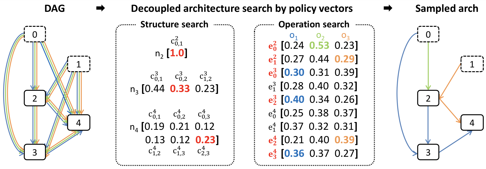
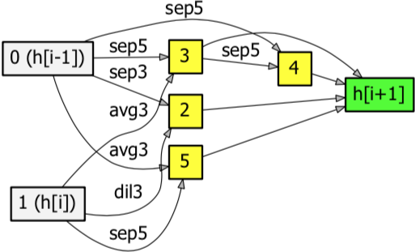
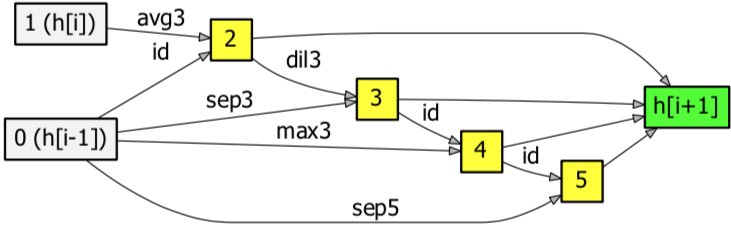

# Efficient Decoupled Neural Architecture Search by Structure and Operation Sampling (EDNAS)

These source codes are authors' pytorch implementation of EDNAS.
Our codes are implemented based on pytorch implementation of DARTS (https://github.com/quark0/darts).

<p align="center">
  
</p>
<p align="center">
Fig 1. An example of the convolutional cell sampling by EDNAS.
</p>

<p align="center">
  
</p>
<p align="center">
Fig 2. An example of the recurrent cell sampling by EDNAS.
</p>

## Requirements
```
Python >= 3.5.5, PyTorch == 0.3.1, torchvision == 0.2.0
```

## Convolutional Cell Search with CIFAR-10
**Data and Experiment Setting**

The CIFAR-10 dataset has 50,000 training images and 10,000 testing examples. Among the training examples, EDNAS uses 40,000 images for training models and 10,000 images for training policy vectors in the architecture search.

In architecture search, EDNAS uses 2 input nodes and 4 operation nodes to design the architecture in a cell. We construct the whole architecture using 6 normal cells and 2 reduction cells and each reduction cell is located after 2 normal cells. Our approach utilizes the following hyper-parameters. For training child models, we employ SGD with the Nesterov momentum with the learning rate 0.05 and the batch-size 128. For learning the policy vectors, the optimization is given by the Adam with the learning rate 0.00035. Both child models and the policy vectors are trained for 300 epochs.

We adopt a different architecture for performance evaluation, which is composed of 20 cells (18 normal cells and 2 reduction cells); 6 normal cells are followed by a reduction cell twice, and there are 6 normal cells with the auxiliary classifier at the end of the network to reduce the vanishing gradient problem.
The learning rate is 0.025, the batch size is 128, and the network is trained for 600 epochs.
We optimize the network using SGD without the Nesterov momentum and incorporate the cutout method for better generalization.
Regarding the computing environment, we used p3.2xlarge type instances of Amazon Web Services, which utilize NVIDIA V100 GPU.

**Results**
- Search cost: 0.28 GPU days
- Test error: 2.84%
- Parameters: 3.7M

<p align="center">
  
</p>
<p align="center">
Fig 3. The normal cell discovered by EDNAS on CIFAR-10.
</p>

<p align="center">
  
</p>
<p align="center">
Fig 4. The reduction cell discovered by EDNAS on CIFAR-10.
</p>

## Convolutional Cell Search with ImageNet
**Data and Experiment Setting**

The ImageNet dataset contains almost 1.2M images in 1,000 classes for training. For our architecture search, we use 1M images to train the model and 0.2M images to train policy vectors. Our algorithm for ImageNet has the exactly same search space with CIFAR-10 except that it has the additional stem module to convert input images.

We employ the SGD optimizer for architecture search without the Nesterov momentum, where the initial learning rate is 0.05, which is reduced by the factor of 10 at every 10 epoch. Adam is used for policy vector search with learning rate 0.00035. The batch sizes for training model and policy vector search are 200 and 50, respectively. The training is carried out for 50 epochs.

The architecture for performance evaluation is composed of 14 cells (12 normal cells and 2 reduction cells), where each reduction cells follows a series of 4 normal cells. Also, we integrate the auxiliary classifier to learn the model using an SGD with the learning rate 0.1, the batch size 200, and the network is trained for 250 epochs.

## Recurrent Cell Search with Penn Treebank
**Data and Experiment Setting**

Penn Treebank dataset is a widely-used benchmark dataset for language modeling task. Our experiment is conducted on the standard preprocessed version. For architecture search, we set the embedding size and the hidden state size to 300, and train the child network using the SGD optimizer without momentum for 150 epochs. We set the learning rate to 20 and the batch size to 256. Also, dropout is applied to the output layer with a rate of 0.75. To train the policy vectors, we use the Adam optimizer with learning rate 0.003.

For evaluation, the network is trained using the averaged SGD (ASGD) with the batch size 64 and the learning rate 20. The network is trained for 1600 epochs.

The embedding size are set to 850, and the rest of hyper-parameters are identical to the architecture search step.

## Acknowledgments
This source codes were developed by Heung-Chang Lee and Do-Guk Kim. The project was supported in part by the Hana TI.
